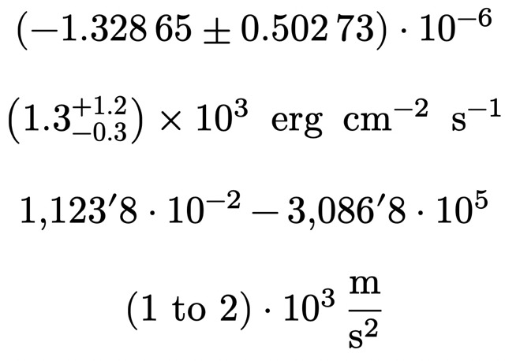

# Unify
`unify` is a [typst](https://github.com/typst/typst) package simplifying the typesetting of number, (physical) units, and ranges. It is the equivalent to LaTeX's `siunitx`, though not as mature.


## Overview
`unify` allows flexible numbers and units, and still mostly gets well typeset results.
```ts
#import "@preview/unify:0.0.2": num,unit,range,unit-range

$ #num("-1.32865+-0.50273e-6") $
$ #qty("1.3+1.2-0.3e3", "meter per second squared") $
$ #numrange("1e-2", "3e5") $
$ #qtyrange("1e3", "2e3", "meter per second") $
```



## `num`
`num` uses string parsing in order to typeset numbers, including separators between the thousands. They can have the following form:
- `float` or `integer` number
- either (`{}` stands for a number)
    - symmetric uncertainties with `+-{}`
    - asymmetric uncertainties with `+{}-{}`
- exponential notation `e{}`

Parentheses are automatically set as necessary. Use `thousandsep` to change the separator between the thousands.


## `unit`
`unit` takes the unit in words as its first argument. Later on, I will make a shorthand notation. The value of `space` will be inserted between units if necessary.  
Units have four possible parts:
- `per` forms the inverse of the following unit.
- A prefix in the sense of SI. This is added before the unit.
- The unit itself.
- A postfix like `squared`. This is added after the unit and takes `per` into account.

The possible values of the three latter parts are loaded at runtime from `prefixes.csv`, `units.csv`, and `postfixes.csv` (in the library directory). There, you can also add your own units. The formats for the pre- and postfixes are:

| pre-/postfix | symbol       |
| ------------ | ------------ |
| milli        | upright("m") |

and for units:

| unit  | symbol       | space |
| ----- | ------------ | ----- |
| meter | upright("m") | true  |

The first column specifies the whole word that will be replaced. This should be unique. The second column represents the string that will be inserted as the unit symbol. For units, the last column describes whether there should be space before the unit (possible values: `true`/`false`, `1`,`0`). This is mostly the cases for degrees and other angle units (e.g. arcseconds).  
If you think there are units not included that are of interest for other users, you can create an issue or PR.


## `qty`
`qty` allows a `num` as the first argument following the same rules. The second argument is a unit. If `rawunit` is set to true, its value will be passed on to the result (mind that the string passed on will be passed to `eval`, so add escaped quotes `\"` if necessary). Otherwise, it follows the rules of `unit`. The value of `space` will be inserted between units if necessary, and `thousandsep` between the thousands.  


## `numrange`
`numrange` takes two `num`s as the first two arguments. If they have the same exponent, it is automatically factorized. The range symbol can be changed with `delimiter`, and the space between the numbers and symbols with `space`.


## `qtyrange`
`qtyrange` is just a combination of `unit` and `range`.